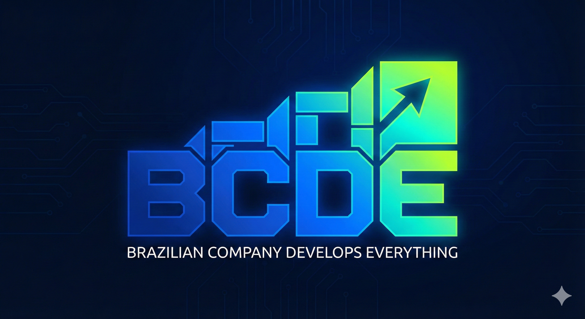

<div align="center">


# BCDE-piper-vozz-rs

**Motor de síntese Piper (ONNX) para pt-BR com fonemização de qualidade.**

Motor neural de TTS com G2P próprio, diálogo multi-voz e arquitetura single-thread para escalar por multiprocessamento.

[](LICENSE)
[](https://www.rust-lang.org)
[]()

</div>

---

## Sumário

- [Sobre](#sobre)
- [Por que existe](#por-que-existe)
- [Ecossistema BCDE](#ecossistema-bcde)
- [Arquitetura](#arquitetura)
- [Instalação](#instalação)
- [Vozes](#vozes)
- [Uso](#uso)
  - [Como biblioteca](#como-biblioteca)
  - [Como worker](#como-worker)
- [Protocolo](#protocolo)
- [Exemplos](#exemplos)
- [Benchmarks](#benchmarks)
- [Testes](#testes)
- [API](#api)
- [Notas de design](#notas-de-design)
- [Licença](#licença)

---

## Sobre

O `BCDE-piper-vozz-rs` é um motor de síntese de fala para português brasileiro, construído sobre modelos **Piper ONNX** e fonemização pelo [`vozz-g2p-rs`](https://github.com/bcdeosce/vozz-g2p-rs).

É distribuído de duas formas:

- **Biblioteca Rust** (`bcde_piper_vozz_rs`) — para embutir em qualquer aplicação.
- **Worker persistente** (`bcde-piper-worker`) — processo single-thread que fala JSON por `stdin`/`stdout`.

O motor não depende de Python, Node, eSpeak ou qualquer runtime externo. É **Rust puro + ONNX Runtime**.

---

## Por que existe

Três motivos nortearam o projeto.

### Licenciamento permissivo

Todo o ecossistema BCDE é distribuído sob **MIT** ou **Apache 2.0** — as duas licenças mais permissivas em uso corrente. Nenhuma dependência copyleft, nenhuma cláusula restritiva. O motor pode ser usado, modificado, redistribuído, vendido ou embutido em produtos comerciais sem obrigação de abrir código.

### Independência de runtime

A pilha roda como **um único binário estático** + ONNX Runtime. Sem `pip install`, sem container pesado, sem dependência de bibliotecas externas em produção. Isso simplifica deploy, reduz superfície de ataque e elimina quebras de compatibilidade.

### Fonemização de qualidade

O G2P pt-BR tem regras complexas: nasalização, sândi, ditongos, trema e desambiguação de homógrafos. O `vozz-g2p-rs` resolve isso com qualidade de nível espeak-ng — incluindo casos como `sede` (seat/thirst), `cinquenta` (trema) e `os animais` (sândi). E é MIT/Apache 2.0 puro.

---

## Ecossistema BCDE

O motor faz parte de um conjunto de três projetos que trabalham em conjunto.

| Projeto | Papel | Licença |
|---------|-------|:-------:|
| [`BCDE-tagger`](https://github.com/bcdeosce/BCDE-tagger) | POS tagging + desambiguação de homógrafos | MIT |
| [`vozz-g2p-rs`](https://github.com/bcdeosce/vozz-g2p-rs) | G2P pt-BR (grafema → fonema) | Apache 2.0 |
| **`BCDE-piper-vozz-rs`** | Motor de síntese | MIT |

---

## Arquitetura

O `bcde-piper-worker` roda como processo persistente. Cada chamada percorre o pipeline abaixo.

```
       texto + [role]
            │
            ▼
   ┌─────────────────┐
   │ Parser [role]   │
   └────────┬────────┘
            │ segmento
            ▼
   ┌─────────────────┐
   │  vozz-g2p-rs    │  normalize → splitter → tagger → g2p
   │  (biblioteca)   │  → IPA no alfabeto Piper
   └────────┬────────┘
            │ chunks com pontuação
            ▼
   ┌─────────────────┐
   │  ONNX Runtime   │  uma inferência por chunk
   │  1 thread/CPU   │
   └────────┬────────┘
            │ PCM i16
            ▼
   ┌─────────────────┐
   │  Orchestrator   │  resample + concat + pausa entre segmentos
   └────────┬────────┘
            │
            ▼
         WAV 16-bit
```

### Por que single-thread por worker

Cada worker roda com `intra_threads=1` e `inter_threads=1`. ONNX Runtime com múltiplas threads compete por CPU e degrada latência p95. Um worker = uma thread = uma CPU física. **N workers = N CPUs em paralelo, sem contenção.**

Medição empírica: `intra_threads=4` + `inter_threads=4` num worker único reduz p95 em até 30% quando há carga, mas a média é pior. Single-thread tem p95 mais estável e escala linearmente.

### Sobre a IPA

Enviar texto direto ao modelo não funciona bem: a fonemização interna não trata corretamente as regras do pt-BR. Pré-fonemizamos com o vozz e entregamos **IPA com pontuação** ao ONNX.

O modelo Piper foi treinado com um `PAD` após cada phoneme e `PAD PAD` após cada pontuação. Reproduzimos esse padrão em `ipa_to_ids`. O modelo gera as pausas naturalmente — sem inserir silêncio manual.

---

## Instalação

### Biblioteca

```toml
[dependencies]
bcde-piper-vozz-rs = { git = "https://github.com/bcdeosce/BCDE-piper-vozz-rs" }
```

### Binário

```bash
git clone https://github.com/bcdeosce/BCDE-piper-vozz-rs
cd BCDE-piper-vozz-rs

# Baixa as vozes pt-BR
./scripts/baixar_vozes.sh

# Compila
cargo build --release
```

O binário fica em `target/release/bcde-piper-worker`.

### Requisitos

- Rust 1.75+ (versão pinada em `rust-toolchain.toml`)
- ONNX Runtime 1.20+ (baixado automaticamente pelo `ort-sys`)

---

## Vozes

Cada voz é uma subpasta em `voices/` com dois arquivos:

```
voices/
├── faber-medium/
│   ├── faber-medium.onnx
│   └── faber-medium.onnx.json
├── edresson-low/
│   ├── edresson-low.onnx
│   └── edresson-low.onnx.json
└── cadu-medium/
    ├── cadu-medium.onnx
    └── cadu-medium.onnx.json
```

### Download automático

O script `scripts/baixar_vozes.sh` baixa as vozes oficiais do [`rhasspy/piper-voices`](https://huggingface.co/rhasspy/piper-voices) no HuggingFace.

```bash
./scripts/baixar_vozes.sh                    # vozes padrão
./scripts/baixar_vozes.sh faber-medium       # voz específica
VOICES_DIR=/outro/dir ./scripts/baixar_vozes.sh
```

Vozes padrão:

| Voz | Sample rate | Tamanho | Qualidade |
|-----|:-----------:|:-------:|:---------:|
| `faber-low` | 16000 Hz | ~20 MB | Baixa |
| `faber-medium` | 22050 Hz | ~63 MB | Média |
| `edresson-low` | 16000 Hz | ~20 MB | Baixa |
| `cadu-medium` | 22050 Hz | ~63 MB | Média |

Qualquer modelo Piper no formato `ONNX + .onnx.json` é aceito.

---

## Uso

### Como biblioteca

#### Diálogo com múltiplas vozes

```rust
use bcde_piper_vozz_rs::{
    dialog::Speaker,
    orchestrator::render_dialogo,
    phonemizer::Phonemizer,
    piper::VoiceManager,
    wav::samples_to_wav_bytes,
};
use std::path::Path;

fn main() -> anyhow::Result<()> {
    let mut voices = VoiceManager::load_from_dir(Path::new("voices"))?;
    let mut ph = Phonemizer::new(
        "BCDE-tagger/data",
        Some(Path::new("lexicon_homografos.json")),
    )?;

    let texto = "[medico] Bom dia, como está se sentindo? \
                 [paciente] Doutor, estou com dor de cabeça.";

    let speakers = vec![
        Speaker { role: "medico".into(),   voice: "faber-medium".into(), sid: None },
        Speaker { role: "paciente".into(), voice: "edresson-low".into(), sid: None },
    ];

    let r = render_dialogo(
        &mut voices,
        &mut ph,
        texto,
        "faber-medium",   // voz default
        &speakers,
        400,              // pausa entre segmentos (ms)
        None, None, None, // length_scale, noise_scale, noise_w
    )?;

    std::fs::write("saida.wav", samples_to_wav_bytes(&r.pcm, r.sr))?;
    Ok(())
}
```

#### Síntese direta (IPA já pronta)

```rust
use bcde_piper_vozz_rs::piper::VoiceManager;
use bcde_piper_vozz_rs::wav::{f32_to_i16, samples_to_wav_bytes};
use std::path::Path;

fn main() -> anyhow::Result<()> {
    let mut mgr = VoiceManager::load_from_dir(Path::new("voices"))?;
    let piper = mgr.get_mut("faber-medium").unwrap();

    let (f32s, sr) = piper.create(
        "ʊ xˈatʊ xoˈew a xˈowpɐ",
        false,   // use_espeak — sempre ignorado
        None,    // speaker_id
        None,    // length_scale
        None,    // noise_scale
        None,    // noise_w
    )?;

    std::fs::write("out.wav", samples_to_wav_bytes(&f32_to_i16(&f32s), sr))?;
    Ok(())
}
```

#### Carregar voz por caminho específico

```rust
use bcde_piper_vozz_rs::piper::Piper;
use std::path::Path;

fn main() -> anyhow::Result<()> {
    let mut piper = Piper::new(
        Path::new("/caminho/custom/voz.onnx"),
        Path::new("/caminho/custom/voz.onnx.json"),
    )?;

    let (amostras, sr) = piper.create("bˈõ dʒiɐ", false, None, None, None, None)?;
    println!("{} amostras @ {} Hz", amostras.len(), sr);
    Ok(())
}
```

### Como worker

O `bcde-piper-worker` lê um JSON por linha do `stdin` e escreve um JSON por linha no `stdout`. Foi desenhado para rodar **1 worker por CPU física**.

#### Variáveis de ambiente

| Variável | Obrigatória | Descrição |
|----------|:-----------:|-----------|
| `VOICES_DIR` | sim | Pasta com as vozes |
| `BCDE_TAGGER_DATA` | para `synthesize_dialog` | Pasta `data/` do BCDE-tagger |
| `LEXICON_HOMOGRAFOS` | opcional | Caminho para `lexicon_homografos.json` |
| `AUDIO_CACHE_DIR` | opcional | Onde salvar WAVs (default: `/tmp/bcde-piper`) |

#### Iniciar

```bash
export VOICES_DIR=/caminho/para/voices
export BCDE_TAGGER_DATA=/caminho/para/BCDE-tagger/data

./target/release/bcde-piper-worker
```

#### Multiprocessamento

```bash
# 8 CPUs físicas
for i in $(seq 1 8); do
  VOICES_DIR=/caminho/voices \
  BCDE_TAGGER_DATA=/caminho/data \
  ./bcde-piper-worker &
done
```

Cada worker carrega todas as vozes em memória (~300 MB com 5 vozes). Com 8 workers, ~2.4 GB total.

---

## Protocolo

### `version`

```json
{"action":"version"}
```

```json
{
  "build": "2024-11-bcde-piper-vozz-v7",
  "features": ["list_voices","reload_voices","synthesize","synthesize_dialog"],
  "has_phonemizer": true
}
```

`has_phonemizer` indica se o `BCDE_TAGGER_DATA` foi encontrado e o tagger carregado. Se `false`, apenas `synthesize` funciona.

### `list_voices`

```json
{"action":"list_voices"}
```

```json
{
  "voices": [
    {"name":"faber-medium","sr":22050,"num_speakers":1},
    {"name":"edresson-low","sr":16000,"num_speakers":1}
  ]
}
```

### `reload_voices`

Recarrega as vozes do disco. Útil depois de adicionar ou remover vozes.

```json
{"action":"reload_voices"}
```

```json
{"ok": true, "voices": ["faber-medium", "edresson-low"]}
```

### `synthesize` — IPA direta

Sintetiza uma string IPA. Sem parser, sem phonemizer.

```json
{
  "action": "synthesize",
  "voice": "faber-medium",
  "ipa": "ʊ xˈatʊ xoˈew a xˈowpɐ",
  "sid": null,
  "len_scale": 1.2,
  "noise_scale": 0.667,
  "noise_w": 0.8
}
```

Todos os campos numéricos são opcionais. `len_scale` e `speed` são sinônimos.

**Resposta:**

```json
{
  "sr": 22050,
  "samples": 46280,
  "duration_ms": 2099,
  "audio_path": "/tmp/bcde-piper/1730000000000000000.wav",
  "audio_bytes": 92560,
  "voice": "faber-medium"
}
```

> O áudio é devolvido como **caminho de arquivo** (`audio_path`), não base64. Isso evita trafegar ~180 KB por chamada. Se o disco falhar, cai automaticamente para `audio_wav_base64`.

### `synthesize_dialog` — texto com tags

Ação principal. Aceita texto com tags `[role]`, fonemiza via vozz-g2p-rs e devolve um WAV único.

```json
{
  "action": "synthesize_dialog",
  "voice": "faber-medium",
  "text": "[medico] Bom dia, como está se sentindo? [paciente] Doutor, estou com dor de cabeça.",
  "speakers": [
    {"role": "medico",   "voice": "faber-medium"},
    {"role": "paciente", "voice": "edresson-low"}
  ],
  "pausa_entre_ms": 400,
  "len_scale": 1.0,
  "noise_scale": 0.667,
  "noise_w": 0.8
}
```

**Resposta:**

```json
{
  "sr": 22050,
  "samples": 98420,
  "duration_ms": 4463,
  "audio_path": "/tmp/bcde-piper/1730000000000000001.wav",
  "audio_bytes": 196840,
  "mode": "dialog",
  "segments": 2
}
```

### Parser de tags

O parser reconhece uma tag inline: **`[role]`**.

- Define o speaker atual. A `voice` do role é resolvida via `speakers[]`.
- Texto antes de qualquer tag usa `voice` do payload.
- Tag desconhecida é ignorada (não quebra o parser).
- Trocar de role muda a voz do segmento seguinte.

**Exemplo:**

```
[medico] Bom dia. [paciente] Dói muito! [medico] Vou examinar.
```

Vira 3 segmentos:

| # | role | text | voice |
|:-:|------|------|-------|
| 0 | medico | "Bom dia." | faber-medium |
| 1 | paciente | "Dói muito!" | edresson-low |
| 2 | medico | "Vou examinar." | faber-medium |

### Resample automático

Vozes diferentes têm sample rates diferentes. Em diálogo com vozes mistas, o orquestrador **resampleia linearmente** para o sr do primeiro segmento. O WAV final é uniforme.

| Voz | Sample rate |
|-----|:-----------:|
| `faber-medium` | 22050 Hz |
| `edresson-low` | 16000 Hz |

### Cliente Python

```python
import subprocess, json, base64
from pathlib import Path
from IPython.display import Audio

class BcdePiper:
    def __init__(self, bin_path, voices_dir, tagger_data):
        import os
        env = {**os.environ,
               "VOICES_DIR": voices_dir,
               "BCDE_TAGGER_DATA": tagger_data}
        self.proc = subprocess.Popen(
            [bin_path],
            stdin=subprocess.PIPE, stdout=subprocess.PIPE,
            stderr=subprocess.DEVNULL, text=True, bufsize=1, env=env)
        self._req({"action": "version"})

    def _req(self, obj):
        self.proc.stdin.write(json.dumps(obj) + "\n")
        self.proc.stdin.flush()
        return json.loads(self.proc.stdout.readline())

    def sintetizar(self, texto, voice="faber-medium",
                   speakers=None, pausa_ms=400,
                   len_scale=None, noise_scale=None, noise_w=None):
        payload = {
            "action": "synthesize_dialog",
            "voice": voice,
            "text": texto,
            "speakers": speakers or [],
            "pausa_entre_ms": pausa_ms,
        }
        if len_scale  is not None: payload["len_scale"]   = len_scale
        if noise_scale is not None: payload["noise_scale"] = noise_scale
        if noise_w     is not None: payload["noise_w"]     = noise_w

        r = self._req(payload)
        if "error" in r:
            raise RuntimeError(r["error"])
        if "audio_path" in r:
            return Path(r["audio_path"]).read_bytes()
        return base64.b64decode(r["audio_wav_base64"])

    def close(self):
        self.proc.stdin.close()
        self.proc.wait(timeout=3)


piper = BcdePiper(
    bin_path="./target/release/bcde-piper-worker",
    voices_dir="./voices",
    tagger_data="./BCDE-tagger/data",
)

wav = piper.sintetizar(
    "[medico] Bom dia, como está se sentindo? [paciente] Estou com dor.",
    voice="faber-medium",
    speakers=[
        {"role": "medico",   "voice": "faber-medium"},
        {"role": "paciente", "voice": "edresson-low"},
    ],
    pausa_ms=400,
)

Audio(wav)
```

---

## Exemplos

O repositório inclui um exemplo mínimo em `examples/sintetizar.rs`.

```bash
./scripts/baixar_vozes.sh

VOICES_DIR=./voices \
BCDE_TAGGER_DATA=/caminho/para/BCDE-tagger/data \
  cargo run --release --example sintetizar -- "Bom dia, como está se sentindo?"
```

O exemplo:

1. Carrega as vozes de `VOICES_DIR`
2. Carrega o tagger de `BCDE_TAGGER_DATA`
3. Sintetiza o texto passado como argumento
4. Salva `saida.wav` no diretório atual

---

## Benchmarks

Benchmarks Criterion em `benches/sintese.rs`.

```bash
cargo bench                          # benchmarks puros (sem modelo)
VOICES_DIR=./voices cargo bench      # inclui síntese ONNX
```

| Benchmark | O que mede |
|-----------|-----------|
| `ipa_to_ids` | Conversão IPA → phoneme IDs |
| `samples_to_wav_bytes` | Encoder WAV (1 s de áudio) |
| `f32_to_i16` | Conversão f32 → i16 (44100 amostras) |
| `sintese ONNX` | Inferência completa com modelo carregado |

Relatório HTML gerado em `target/criterion/report/index.html`.

### Números de referência

Medidos em Intel i7-11800H (8 núcleos físicos), Linux, ONNX Runtime 1.20, single-thread por worker.

| Frase | Latência | RTF |
|-------|:--------:|:---:|
| Curta (< 1 s de áudio) | ~70 ms | ~0.07 |
| Média (~4 s) | ~290 ms | ~0.07 |
| Longa (~5 s) | ~360 ms | ~0.06 |

**RTF ≈ 0.07** significa que 1 segundo de CPU gera ~14 segundos de áudio. Um worker single-thread serve ~14 streams simultâneos em tempo real. Com 8 workers, ~112 streams.

---

## Testes

```bash
cargo test                # todos os testes
cargo test --release      # idem, mais rápido
```

| Módulo | Cobertura |
|--------|-----------|
| `wav.rs` | Header WAV válido, saturação f32→i16, WAV vazio |
| `piper.rs` | BOS/EOS, PAD duplo após pontuação, chars desconhecidos, ZWJ/tie bar |
| `dialog.rs` | Sem tags, uma tag, duas tags, tag desconhecida, retorno ao role, texto vazio |
| `orchestrator.rs` | Resample mesmo sr, downsample, upsample, entrada vazia |

---

## API

### `bcde_piper_vozz_rs::piper`

```rust
pub struct Piper { /* ... */ }

impl Piper {
    pub fn new(onnx_path: &Path, config_path: &Path) -> Result<Self>;
    pub fn sample_rate(&self) -> u32;
    pub fn num_speakers(&self) -> u32;
    pub fn id_map(&self) -> &HashMap<String, Vec<i64>>;
    pub fn create(
        &mut self,
        ipa: &str,
        use_espeak: bool,
        speaker_id: Option<i64>,
        length_scale: Option<f32>,
        noise_scale: Option<f32>,
        noise_w: Option<f32>,
    ) -> Result<(Vec<f32>, u32)>;
}

pub struct VoiceManager { /* ... */ }

impl VoiceManager {
    pub fn load_from_dir(dir: &Path) -> Result<Self>;
    pub fn get(&self, name: &str) -> Option<&Piper>;
    pub fn get_mut(&mut self, name: &str) -> Option<&mut Piper>;
    pub fn list(&self) -> Vec<String>;
    pub fn len(&self) -> usize;
}
```

### `bcde_piper_vozz_rs::phonemizer`

```rust
pub struct Phonemizer { /* ... */ }

impl Phonemizer {
    pub fn new(tagger_data: &str, lexicon_path: Option<&Path>) -> Result<Self>;
    pub fn process_chunks(&mut self, texto: &str) -> Result<Vec<Chunk>>;
}
```

### `bcde_piper_vozz_rs::dialog`

```rust
pub struct Speaker {
    pub role: String,
    pub voice: String,
    pub sid: Option<i64>,
}

pub struct Segment { /* ... */ }

pub fn parse_dialogo(
    texto: &str,
    voice_default: &str,
    speakers: &[Speaker],
) -> (Vec<Segment>, usize);
```

### `bcde_piper_vozz_rs::orchestrator`

```rust
pub struct DialogoResultado {
    pub pcm: Vec<i16>,
    pub sr: u32,
    pub segmentos: usize,
}

pub fn render_dialogo(
    voices: &mut VoiceManager,
    ph: &mut Phonemizer,
    texto: &str,
    voice_default: &str,
    speakers: &[Speaker],
    pausa_entre_ms: u32,
    length_scale: Option<f32>,
    noise_scale: Option<f32>,
    noise_w: Option<f32>,
) -> Result<DialogoResultado>;
```

### `bcde_piper_vozz_rs::wav`

```rust
pub fn samples_to_wav_bytes(samples: &[i16], sr: u32) -> Vec<u8>;
pub fn f32_to_i16(samples: &[f32]) -> Vec<i16>;
```

---

## Notas de design

### Worker single-thread

ONNX Runtime com múltiplas threads compete por CPU e degrada latência p95. Um worker = uma thread = uma CPU física. N workers = N CPUs em paralelo, sem contenção.

`intra_threads=4` + `inter_threads=4` num worker único reduz p95 em até 30% sob carga, mas a média piora. Single-thread tem p95 mais estável e escala linearmente.

### IPA com pontuação

O modelo Piper foi treinado com `PAD` após cada phoneme e `PAD PAD` após pontuação. Se enviarmos IPA sem pontuação, o modelo não sabe onde pausar. Com pontuação, ele gera as pausas naturalmente — sem inserir silêncio manual.

### Áudio por caminho de arquivo

Um WAV de 4 s em 22050 Hz tem ~176 KB. Em base64, ~235 KB. Enviar isso dentro de JSON custa ~20 ms por chamada (encode + serialize + write + read + parse + decode). Com `audio_path`, o custo cai para ~1 ms.

### G2P separado

O runtime interno do modelo trata pt-BR com qualidade limitada. Regras específicas — trema, sândi, desambiguação de homógrafos (`sede` seat/thirst), nasalização contextual — são tratadas corretamente pelo `vozz-g2p-rs`.

### `use_espeak` ignorado

A assinatura `create(ipa, use_espeak, ...)` é mantida por compatibilidade de API, mas o argumento é ignorado. Sempre tratamos a entrada como IPA pré-fonemizada.

### Sem config de voz

O objetivo é replicar o comportamento nativo dos modelos com o mínimo de superfície: um modelo, seus defaults, os parâmetros opcionais que o chamador passar. Sem config persistente, sem valores mágicos. O `<voz>.onnx.json` já contém tudo (`sample_rate`, `phoneme_id_map`, `inference` scales).

### `Cargo.lock` versionado

O projeto distribui um binário. Aplicações binárias devem versionar o `Cargo.lock` para builds reprodutíveis. Bibliotecas normalmente não versionam — como o projeto é ambos, escolhemos versionar.

---

## Licença

**MIT**. Veja [LICENSE](LICENSE).

Dependências diretas:

| Crate | Licença |
|-------|:-------:|
| [`vozz-g2p-rs`](https://github.com/bcdeosce/vozz-g2p-rs) | Apache 2.0 |
| [`BCDE-tagger`](https://github.com/bcdeosce/BCDE-tagger) | MIT |
| [`ort`](https://github.com/pykeio/ort) | Apache 2.0 / MIT |

Nenhuma dependência copyleft. Nenhum runtime externo. Nenhuma cláusula restritiva.

---

## Créditos

- **[rhasspy/piper](https://github.com/rhasspy/piper)** — modelo de TTS neural, arquitetura ONNX, especificação de vozes
- **[pykeio/ort](https://github.com/pykeio/ort)** — bindings Rust para ONNX Runtime
- **[vozz-g2p-rs](https://github.com/bcdeosce/vozz-g2p-rs)** — fonemizador pt-BR com desambiguação de homógrafos
- **[BCDE-tagger](https://github.com/bcdeosce/BCDE-tagger)** — POS tagging para pt-BR
- **[rhasspy/piper-voices](https://huggingface.co/rhasspy/piper-voices)** — vozes pt-BR oficiais

---

<div align="center">

Feito com ❤️ para a comunidade pt-BR.

</div>
